Watch Me is a simple social media mobile app like instragram.
# Note
The backend for this flutter project is made in Node.js and the bakcend is in the github reopository named "Memento-WatchMe-Backend".

# Features
1. Upload post (1-12 images)
2. Wach and unwatch users
3. Tag watchers while uploading post
4. Get posts from watched users
5. Like post
6. Comment post
7. Report post
8. View the users who liked the post
9. View the users who commented on the post
10. View tagged users on the post
11. Search users according to username and email
12. Get Notifications of new posts, tagging, watching, like, comment, and report on the post
13. View user profile
14. View wathers
15. View watched users
16. view upload and tagged posts

# Screenshots
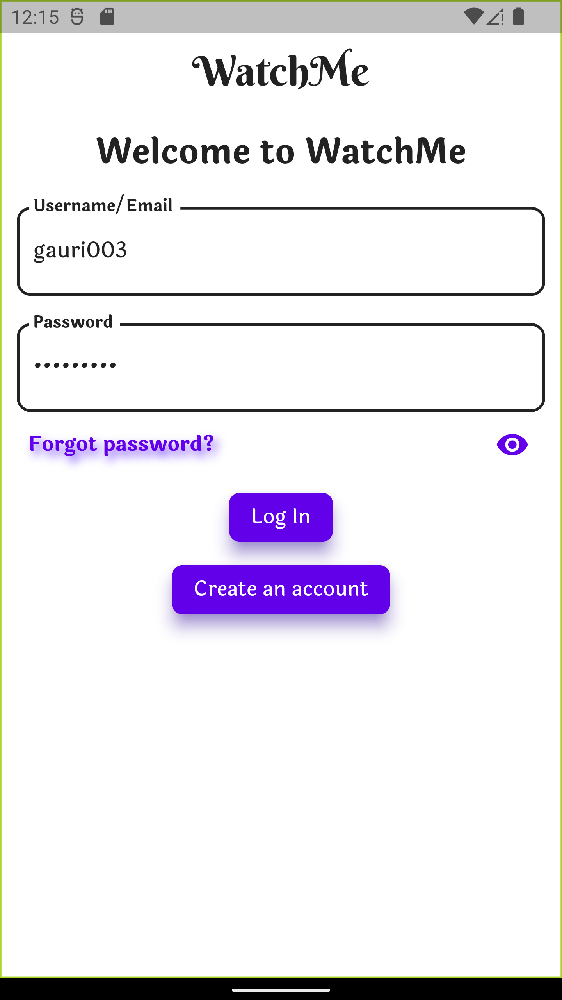
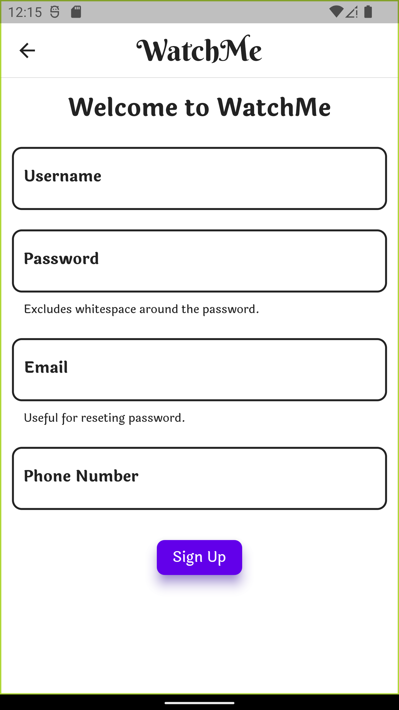
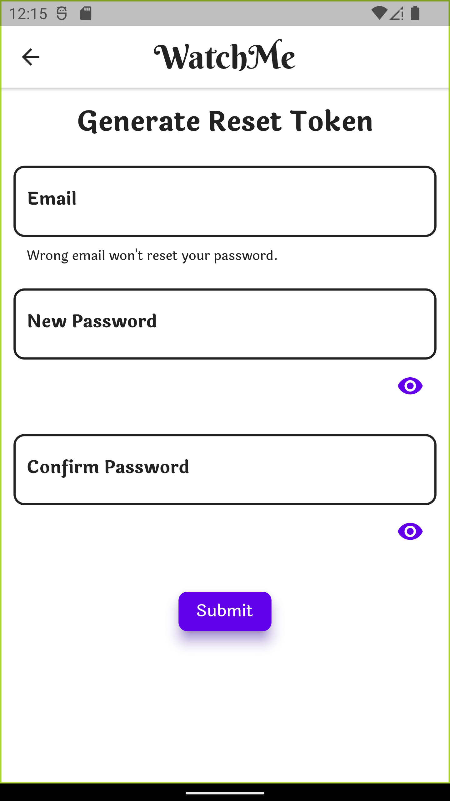

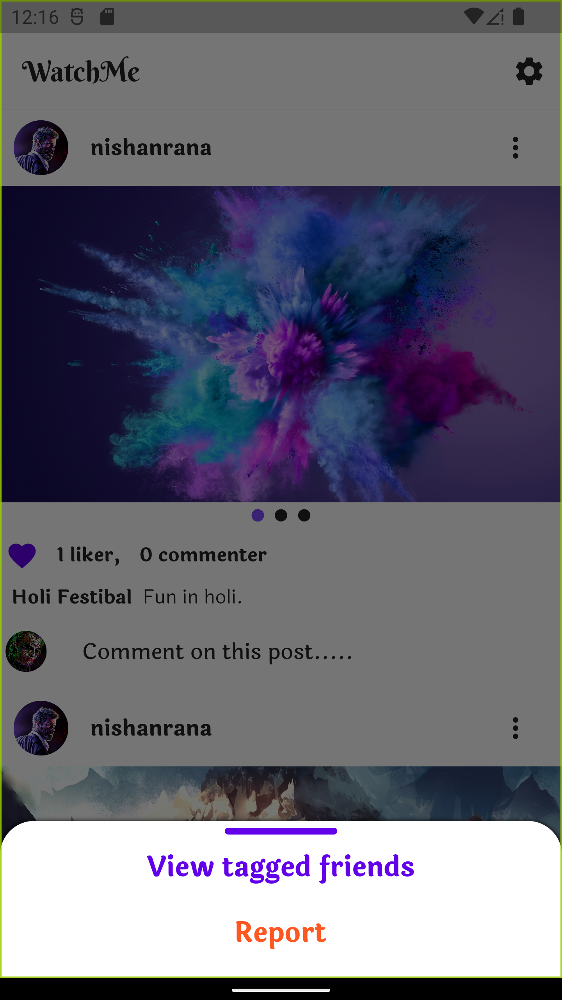
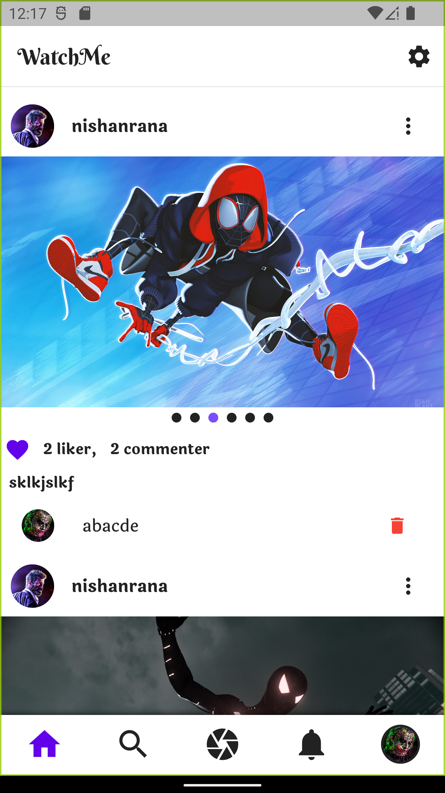
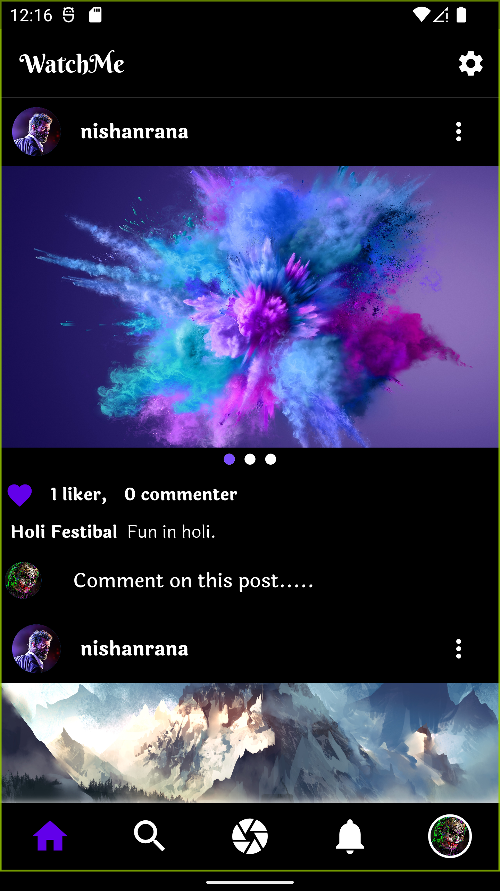
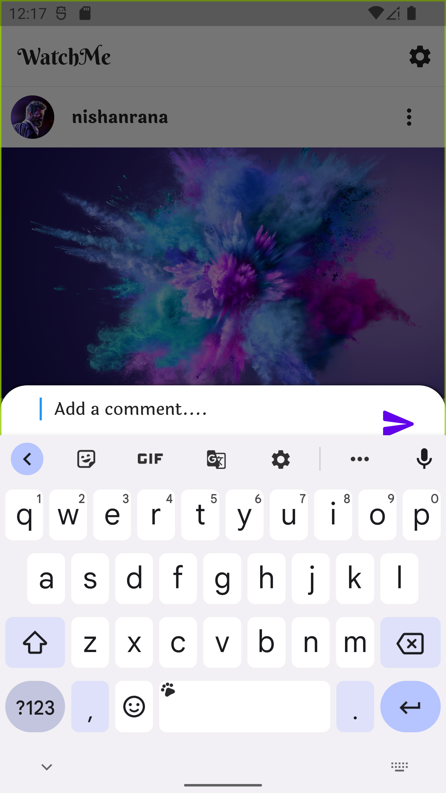

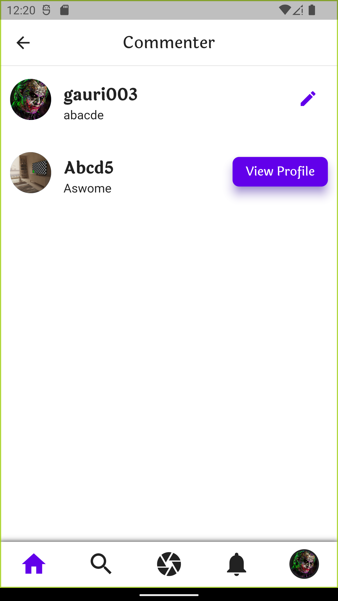
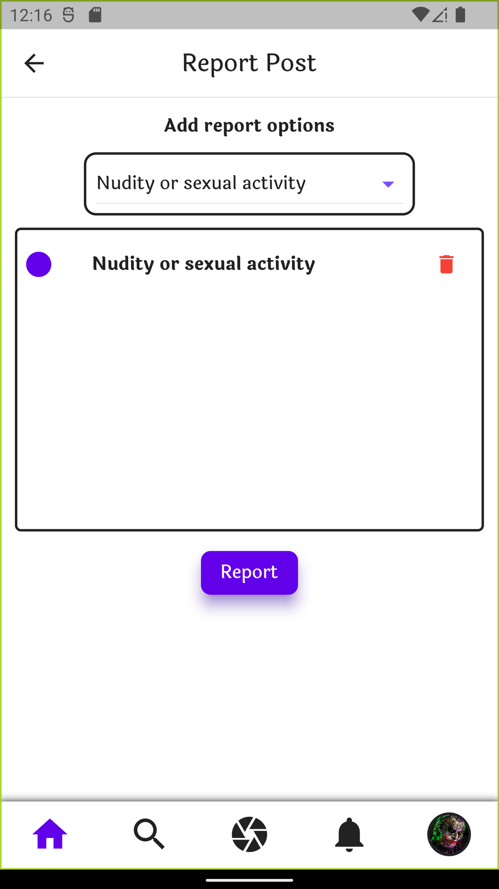
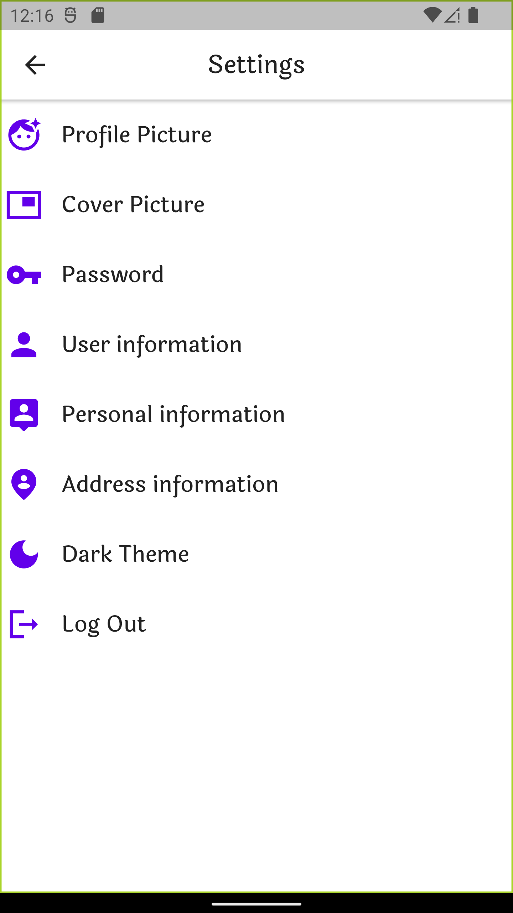
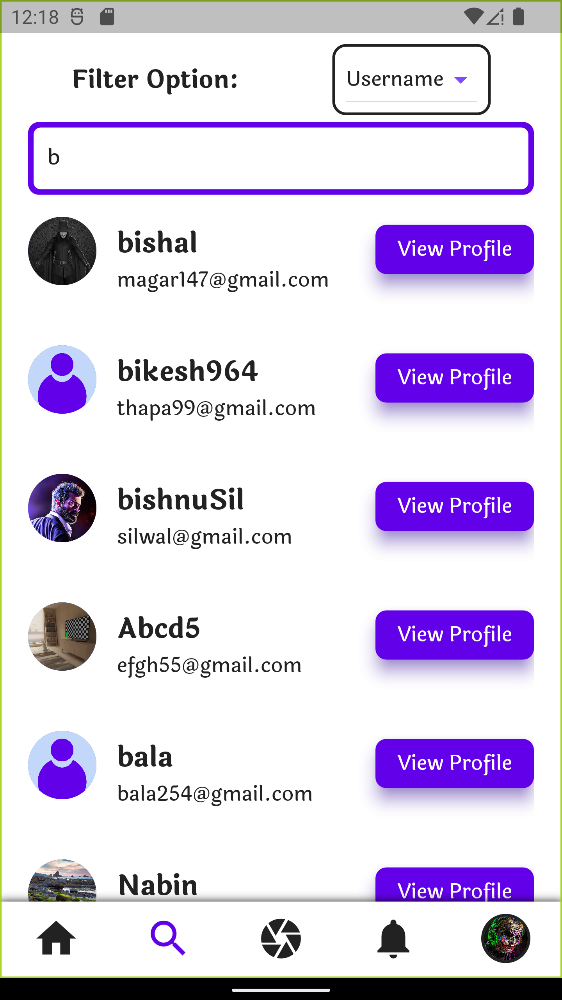

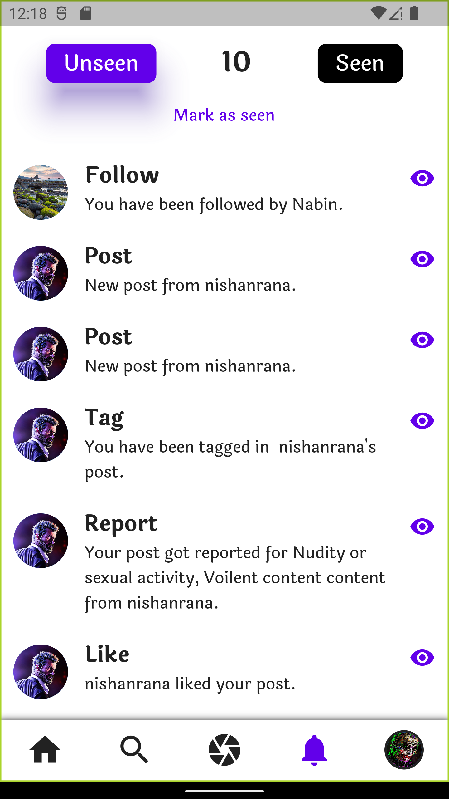

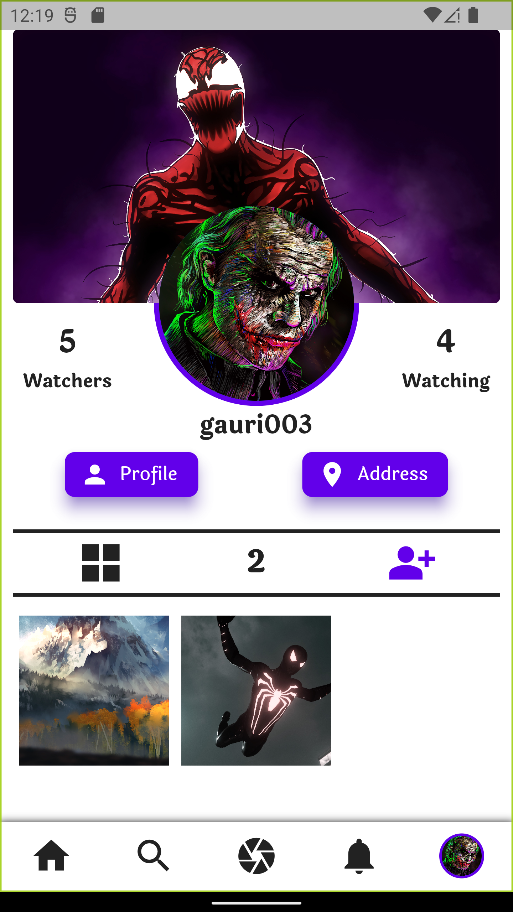

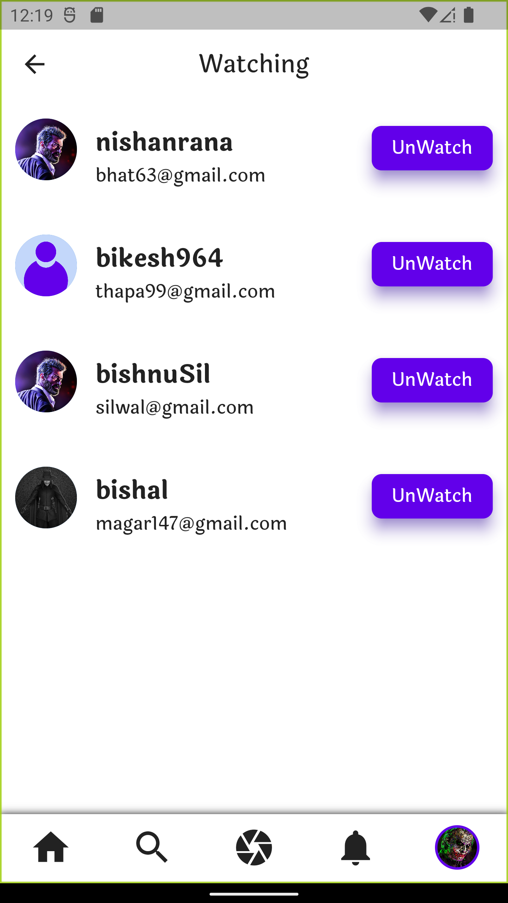
